# BookNooks Tracker

BookNooks is a full-stack Django web application for managing a personal book library. Users can register, log in, and keep track of their own books in a secure and user-friendly way. This project is deployed on Heroku.

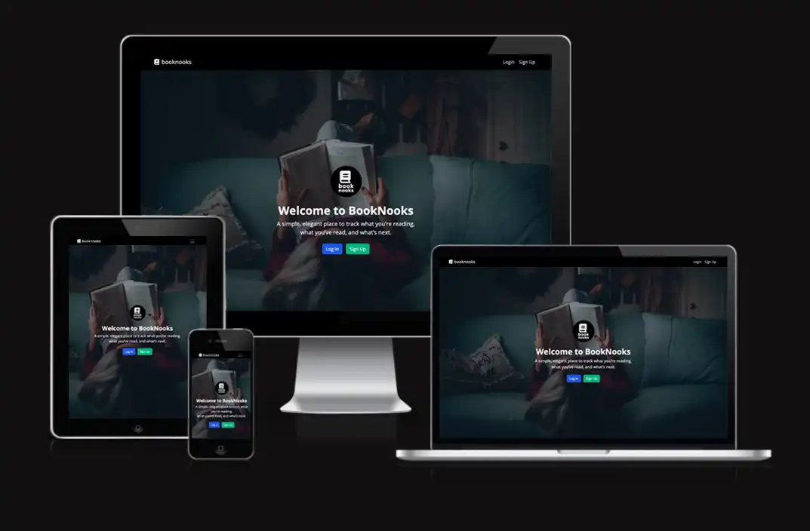 

[You can view this app here](https://booknooks-project-app-5c3a20ad5555.herokuapp.com/)

## Project Overview

- **Name**: BookNooks Tracker
- **Type**: Full-Stack Django web application
- **Purpose**: Lets users manage their personal book collection (add, view, edit, delete).
- **Tech Stack**: Django, Python, HTML, CSS, Bootstrap, PostgresSQL.
- **Deployment**: Heroku
- **Version Control**: Github with Agile workflow (Kanban board & MoSCoW priorities)

----

## Agile Planning
- **Methodology**: Agile, tracked with Github Projects board (Kanban)

### MoSCoW Prioritisation

| Priority           |  User Story (summary)                         |   Notes/Acceptance Highlights                                         |
|--------------------|-----------------------------------------------|-----------------------------------------------------------------------|
| **Must**           |   Register & log in                           |   Users can sign up, log in/out; secure auth; redirect after log in.  |
| **Must**           |   Add a new book (title, author, notes)       |   Required fields validated; links books to the logged-in owner.      |
| **Must**           |   View my book list                           |   Only shows books owned by current user.                             |
| **Must**           |   Edit a book                                 |   Update title,/author/notes; redirects back to list on success.      |
| **Must**           |   Delete a book                               |   Owner-only delete with confirmation; redirects after delete.        |
| **Must**           |   Admin access                                |   Staff can manage users/books via Django Admin.                      |
| **Should**         |   Search my books (title/author)              |   Search bar filters current user's books.                            |
| **Should**         |   Set stauts: To Read / Reading / Finished    |   Status field on form; persisted per books.                          |
| **Should**         |   Filter by status                            |   Lists can be filtered by status; works with search.                 |
| **Could**          |   Upload a cover image                        |   Optional image; placeholder if missing; thumbnail in list.          |
| **Could**          |   Rate books (1-5)                            |   Rating stored per user; display list/detail.                        |
| **Could**          |   Export my books as CSV                      |   CSV contains key fields for current user's collection only.         |
| **Won't**          |   In-App purchasing / bookstore integration   |   Out of scope: payments/e-commerce not needed for this project.      |
| **Won't**          |   Social sharing of book lists                |   Out of scope: social integrations reserved for future versions.     |
| **Won't**          |   Goodreads / Kindle import / export          |   Out of scope: third-party API integration not needed for project.   |
| **Won't**          |   AI recommendation                           |   Out of scope: ML/AI recommendations not required for project.       |

----

## UX Design

The design of BookNooks Tracker focuses on simplicity and readability:

- Dark-themed navbar for clear navigation.

- Responsive layout using Bootstrap grid and custom CSS variables.

- Consistent branding with the BookNooks logo on the landing page.

- Hero section welcoming users with a short description of the site’s purpose.

-----

### App Flowchart:

Before I started building the App, I mapped out the basic structure of the flowchart and I used LucidApp to create the flowchart.


-----

### Website wireframe:

Part of the I started designing the website, I went to the drawing board to map out the design structure. 

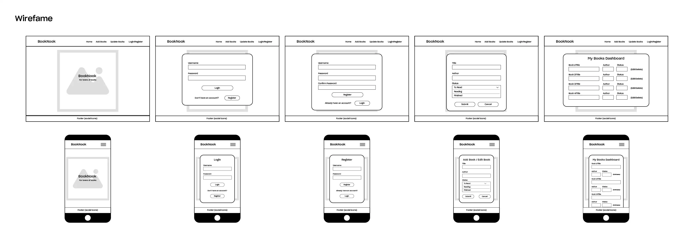

-----

## How the App works:

This section demonstrates the main flows of the BookNooks Tracker application with screenshots.

### 1. Landing Page
- Users are welcomed with the BookNooks logo and a short intro message.
- Navigation bar links: *Login, Sign Up, My Book, Add Books, Logout*.

Navbar:


Landing Page:


---

### 2. User Authentication
- New users can **sign up**.
- Existing users can **log in**.
- Once logged in, users see their personalised navigation options.

- Signup:
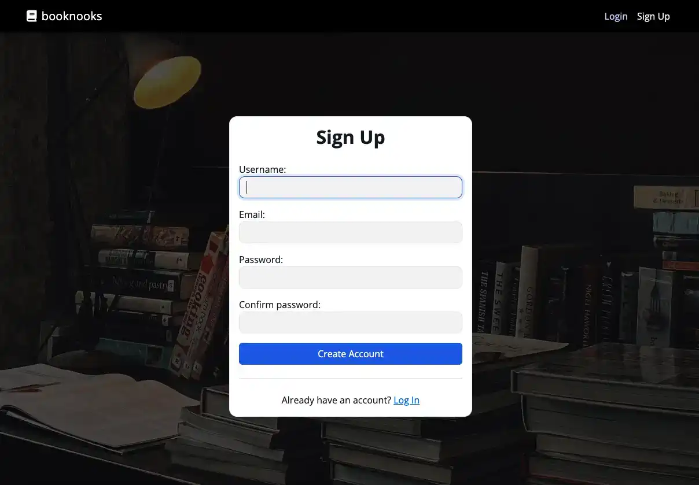

- Signup Validation:
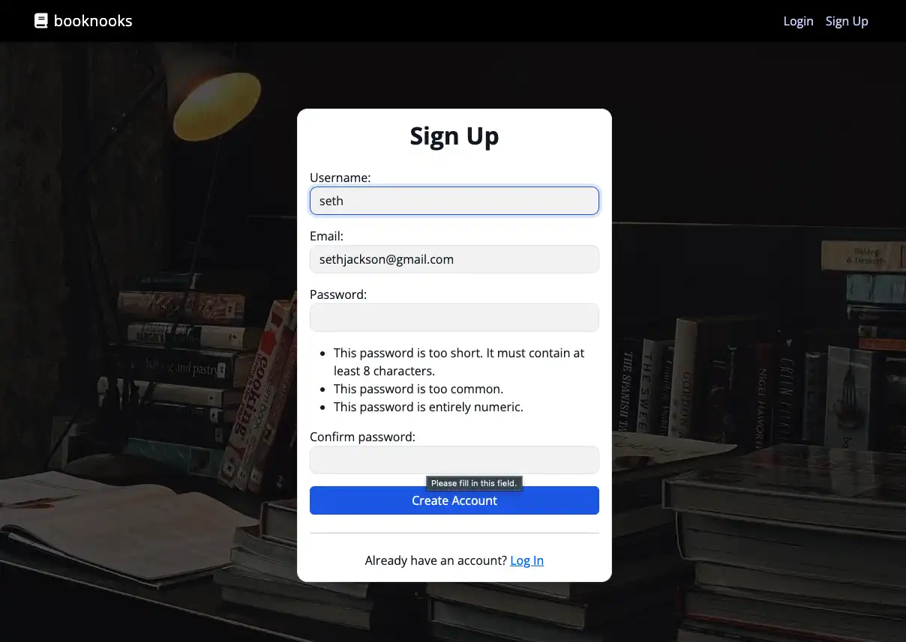

---

### 3. Add a Book
- From *Add Book* page, users can enter:
  - Title
  - Author
  - Description
  - Date read
- After saving, the book is linked to the logged-in user.

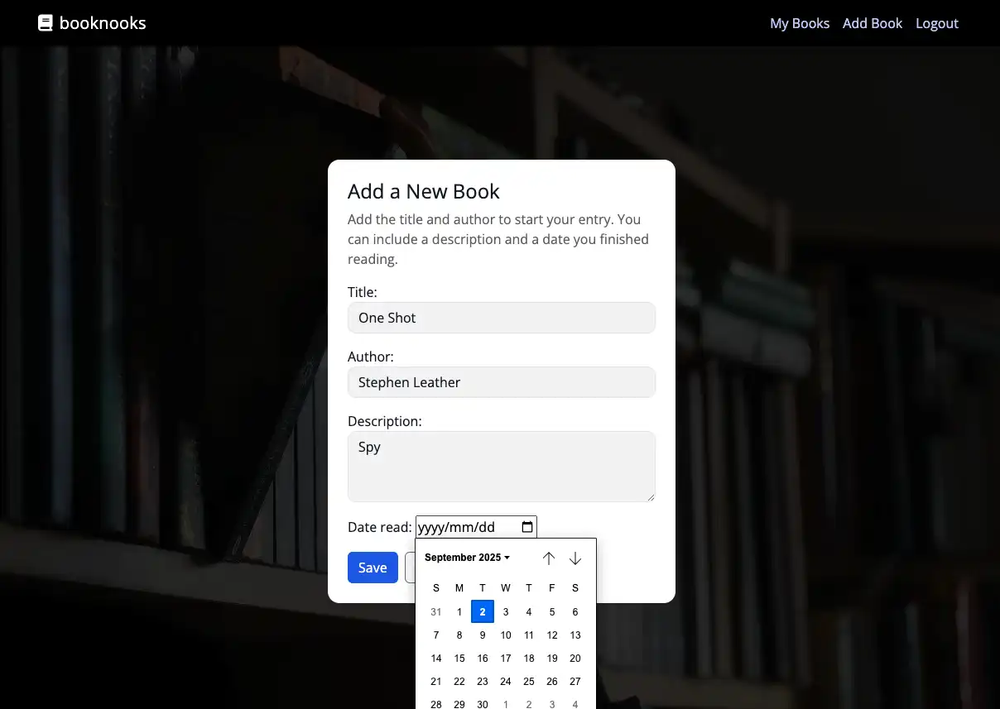

---

### 4. View My Books
- Displays a list of all books added by the user.
- Styled with cards/lists for readability.

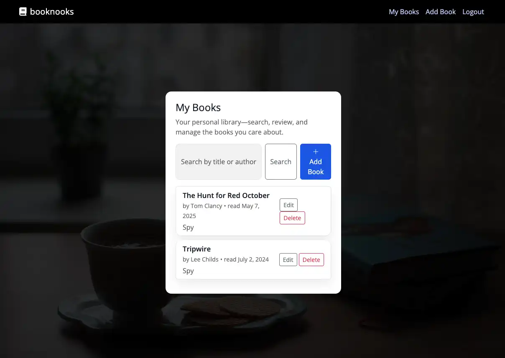

---

### 5. Update or Delete Books
- Each book entry has **Edit** and **Delete** buttons.
- Edit opens the update form with prefilled details.
- Delete asks for confirmation before removing.

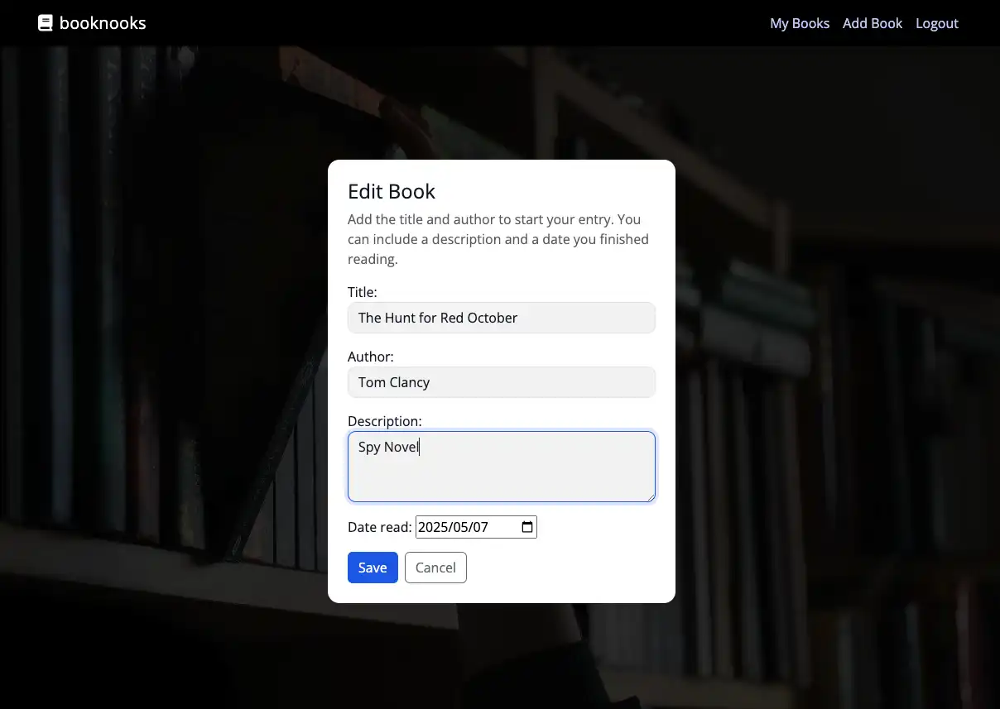

---

### 6. Flash Messages & Feedback
- Success and error messages appear after actions (e.g., book added, book deleted).

- Book succesfully added:

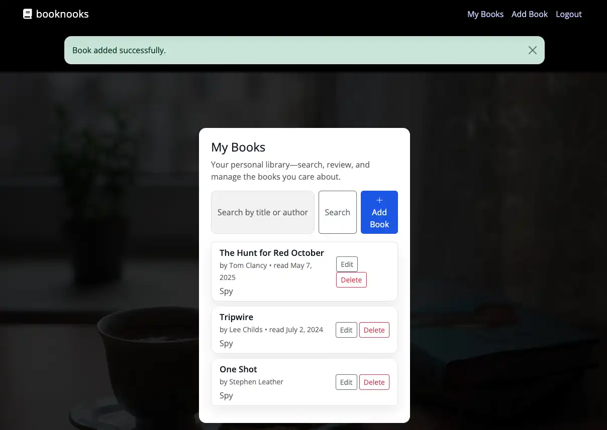

- Delete book alert message:

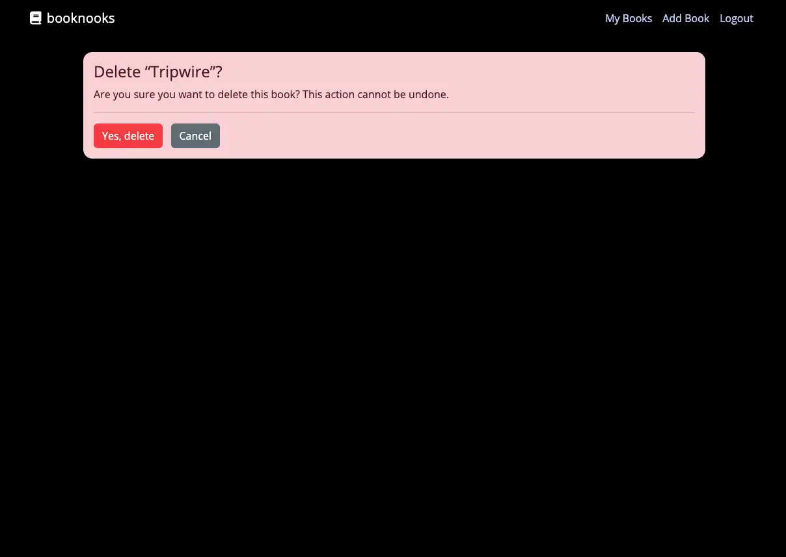

- Book successfully deleted:

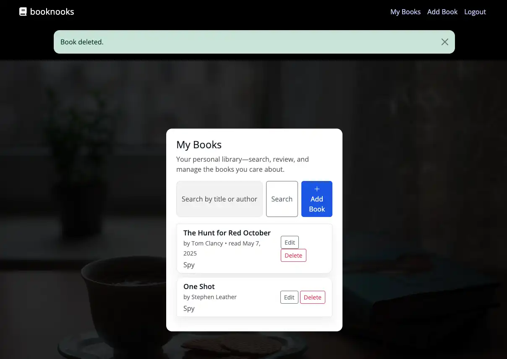

---

### 7. Responsive Design
- Layout adapts to mobile, tablet, and desktop.


-----

## Features

### Implemented
- User Registration (`/signup/`)
- User Login/Logout (`/accounts/login/`, `/accounts/logout/`)
- Add Book (with title, author, description, date read)
- View Book List (shows only current user's books; empty state if none)
- Edit Book (update title/author/descirption/date)
- Delete Book (confirming before removal)
- Tests covering all above flows

## 📚 Feature Overview

| Function / View | Description | Key Features |
| --------------- | ----------- | ------------ |
| `signup(request)` | Handles new user registration | Uses Django’s `UserCreationForm`; validates username & password; redirects to login on success |
| `login` / `logout` (Django built-in auth views) | Manages user authentication | Secure login/logout; only authenticated users can access book management features |
| `index(request)` | Landing page view | Welcomes users with logo + intro message; provides navigation to key sections |
| `book_list(request)` | Displays all books belonging to the logged-in user | Uses query filtering (`Book.objects.filter(owner=request.user)`); includes a search bar for title/author; styled list with edit/delete actions |
| `book_create(request)` | Allows users to add new books | Displays form for Title, Author, Description, Date Read; automatically binds created book to logged-in user; validates inputs |
| `book_update(request, pk)` | Allows editing details of an existing book | Pre-populates form with existing data; validates updates; restricted to the owner |
| `book_delete(request, pk)` | Allows users to delete a book | Confirms before deletion; restricted to the owner; removes book from DB on success |
| `debug_template(request)` *(dev only)* | Simple debug view to verify template rendering | Renders a test variable into `debug.html`; helps confirm template/static setup in deployment |


----

## Deployment & Version Control

Deployment: Heroku (https://booknooks-project-app.herokuapp.com/)

Database:
- Development: SQLite (default Django)
- Production: PostgreSQL (via Heroku DATABASE_URL)
- Version Control: GitHub with Agile workflow
- GitHub Projects Kanban board with MoSCoW prioritisation
- Branching and feature commits following best practices

1. **Procfile** created to run Gunicorn.
2. **requirements.txt** generated with `pip freeze > requirements.txt`.
3. **Static files** collected with `python3 manage.py collectstatic`.
4. **Database still to be added here** used as production database.
5. **Deployment via:
    ```bash
    git push heroku main

[Live App](https://booknooks-project-app-5c3a20ad5555.herokuapp.com/) 

---

## Testing

The **BookNooks Tracker App** includes automated tests for all *Must-Have* user stories.
Tests are written using Django's built-in test framework and includes unit tests for MUST_HAVE features (add, list, edit, delete books; authentication; ownership checks).

### How to Run Tests

From the project root (same level as `manage.py`):

```bash
python3 manage.py test books -v 2


Example test run:

Ran 11 tests in 16.706s

OK
```
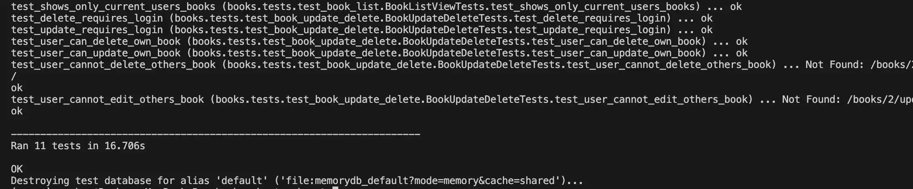 

### Other tests conducted were:

#### Create flow
```python3 manage.py test books.tests.test_book_create -v 2```

#### List flow
```python3 manage.py test books.tests.test_book_list -v 2```

#### Update/Delete flow
```python3 manage.py test books.tests.test_book_update_delete -v 2```

---

## 🗄️ Database (LO3)

The `Book` model is central to the project:

```python
class Book(models.Model):
    title = models.CharField(max_length=200)
    author = models.CharField(max_length=200)
    description = models.TextField(blank=True)
    date_read = models.DateField()
    owner = models.ForeignKey(
        settings.AUTH_USER_MODEL,
        on_delete=models.CASCADE
    )
```


> [!NOTE]  
> For all testing, please refer to the [TESTING.md](TESTING.md) file.


## Technologies Used

- Python 3.12 — Backend language.

- Django 4.2 — MVC web framework.

- Bootstrap 5 — Responsive frontend framework.

- Heroku — Deployment platform.

- Postgres — Production database.

- SQLite — Development database.

- GitHub Projects — Agile project management.

-------

## References/Credits

1. Unsplash for visuals for website - [Unsplash](https://unsplash.com/)

2. Youtube video Tutorial on Introduction to GitHub Project Boards by Mickey Gousset - [Introduction to GitHub Project Boards](https://www.youtube.com/watch?v=idZyqNIrt84)

3. Code Institute Tutorials on Portfolio Project 4: The guide to MVP - [The guide to MVP](https://www.youtube.com/watch?v=vIv1c6RLBac)

4. Youtube video Tutorial on How to fix Django "Bad Request (400)" error with ALLOWED_HOSTS on Heroku by BugBytes - [Django Graph Models command](https://www.youtube.com/watch?v=qzrE7cfc_3Q)

5. Fixing missing templates (`TemplateDoesNotExist`):
Guide explaining how to correctly configure `TEMPLATES['DIRS']` and folder structure in Django.
[Stackoverflow](https://stackoverflow.com/search?q=TemplateDoesNotExist&s=4f5e7569-e960-4b61-9994-15c5abe6aaf7)

6. Organising templates within apps:
Discussion on app-level `templates/` directories and `APP_DIRS=True` in settings.
[Learn Django](https://learndjango.com/tutorials/template-structure)
[Django Forum](https://forum.djangoproject.com/t/extending-get-user-model/28777)

7. Troubleshooting `TypeError` in Django views:
Article highlightes strategies for identifying invalid arguments, non-iterables, and debugging TypeErrors during view rendering.
[MoldStud](https://moldstud.com/articles/p-essential-tips-for-fixing-django-typeerror-in-view-functions)
[Stackoverflow](https://stackoverflow.com/questions/68623861/how-to-fix-this-exception-and-type-error-django)

8. Common Django errors and fixes:
A concise overview of frequent Django errors—such as field typos, forgeting migrations, or template lookup issues—and how to fix them. 
[Django documentation](https://docs.djangoproject.com/en/5.2/faq/troubleshooting/)
[Medium articles](https://medium.com/@kanithkar_baskaran/13-django-error-with-solution-775e247c25be) 

9. My mentor, Rory Sheridan, for his advice, guidance and motivation through the project.

------