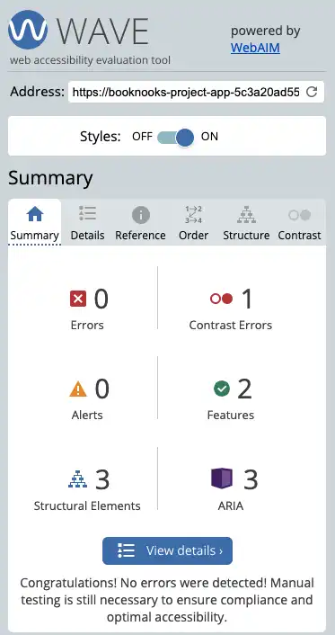
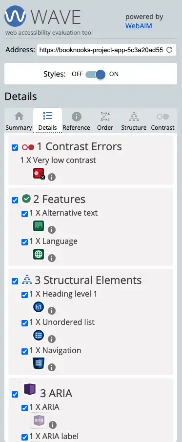
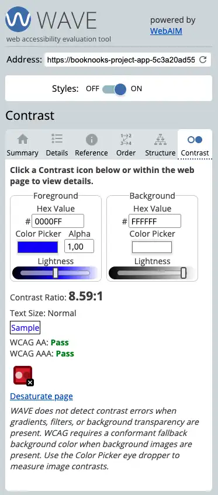
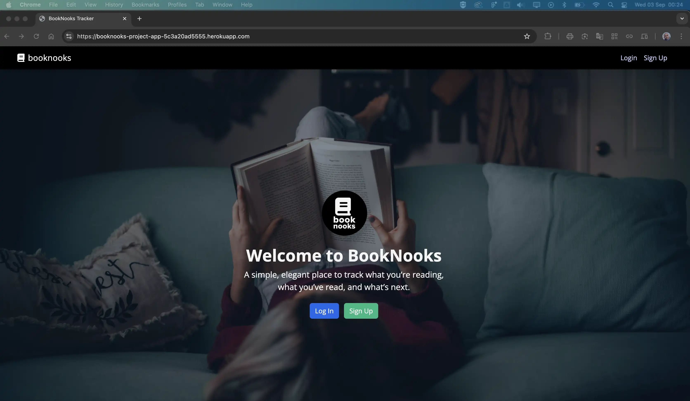
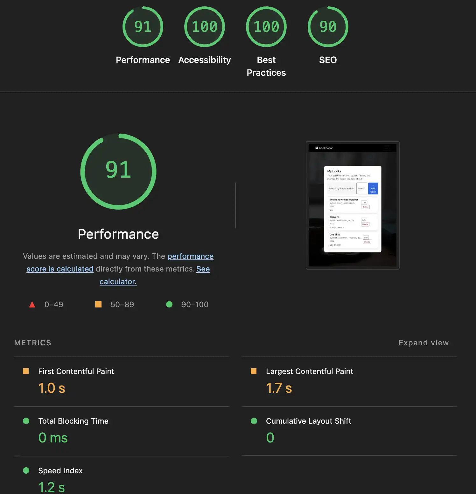

# Testing

> [!NOTE]  
> Return back to the [README.md](README.md) file.

## Code Validation

### HTML

I have used the recommended [HTML W3C Validator](https://validator.w3.org) to validate all of my HTML files.

| File | screenshot | Notes |                                                                                                 |
| --- | --- | --- | ----------------------------------------------------------------------------------------------------------|
| https://booknooks-project-app-5c3a20ad5555.herokuapp.com/ |  | Pass: No Errors |

-----

### CSS

I have used the recommended [CSS Jigsaw Validator](https://jigsaw.w3.org/css-validator) to validate all of my CSS files.

| File | screenshot | Notes |                                                                                                 |
| --- | --- | --- | ----------------------------------------------------------------------------------------------------------|
| style.css  |  |  Pass: No Errors |

-----

### WAVE Web Accessibility Evaluation Tool

I've also tested my deployed project on WAVE Web Accessibility Evaluation Tool to check for any issues.

| Browser | Summary | Details | Structure | Contrast | Homepage | Notes |
| --- | --- | --- | --- | --- | --- | --- |
| Chrome |  |  |  |  |  | Pass: No Errors |
| |

## Browser Compatibility

I've tested my deployed project on multiple browsers to check for compatibility issues.

| Browser | Home | Notes |  |
| --- | --- | --- | --- | 
| Chrome |  | Works as expected |
| Firefox |  | Works as expected |
| Safari |  | Works as expected |

## Lighthouse Audit

I've tested my deployed project using the Lighthouse Audit tool to check for any major issues.

| Page | Mobile | Desktop | Notes |
| --- | --- | --- | --- | 
| Home |  |  | Warnings: 
Uses deprecated APIs 1 warning found. |
| Signup |  |  | Largest Contentful Paint element 6,260 ms. |
| Login |  |  | Largest Contentful Paint element 6,490 ms. |
| My Books |  |  | Preconnect to required origins Est savings of 280 ms. |
| Add Books |  |  | Preconnect to required origins Est savings of 350 ms. |

## Responsiveness

I've tested my deployed project for responsiveness issues.

| Device | Home | Notes |  |
| --- | --- | --- | --- | 
| Mobile (DevTools) |  | Works as expected | 
| Tablet (DevTools) |  | Works as expected |
| Desktop (DevTools) |  | Works as expected |

> [!NOTE]  
> Return back to the [README.md](README.md) file.